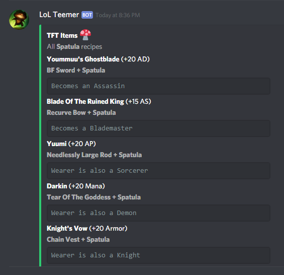
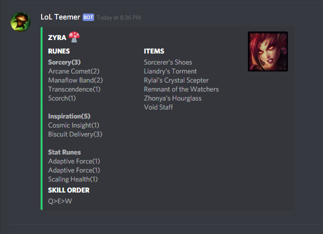

# LoL-Teemer-Discord-Bot  
# Information  
This is a discord bot hosted at Heroku, that scrapes data from champion.gg, uploads them to ```MongoDB``` and displays them in Discord using bot commands.  
# Invite the bot to your server  
Paste the link in the browser~~https://discordapp.com/api/oauth2/authorize?client_id=589192232943484929&scope=bot&permissions=75776~~ and select the server.(**Bot is not up to date currently**)
# Usage  
Enter the command ```!help``` to see all availabe bot commands.   
# Screenshot(s)  
  
 
# Stuff Used in this project  
 * discord.py
 * PyMongo  
 * BeautifulSoup4  
 * Riot Games API  
# Disclaimer  
"LoL-Teemer-Discord-Bot" isn’t endorsed by Riot Games and doesn’t reflect the views or opinions of Riot Games
or anyone officially involved in producing or managing League of Legends. League of Legends and Riot Games are
trademarks or registered trademarks of Riot Games, Inc. League of Legends © Riot Games, Inc.

